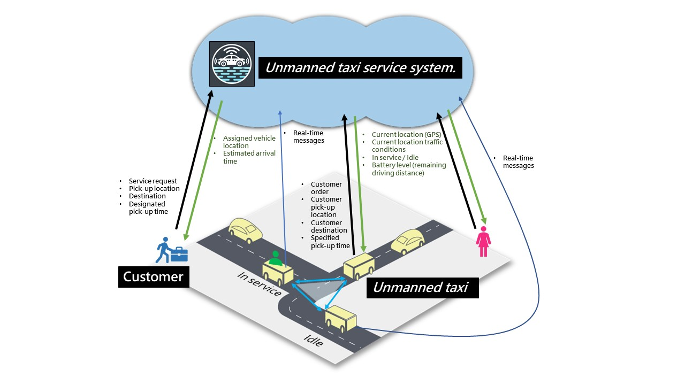
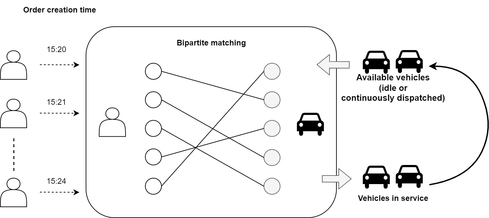
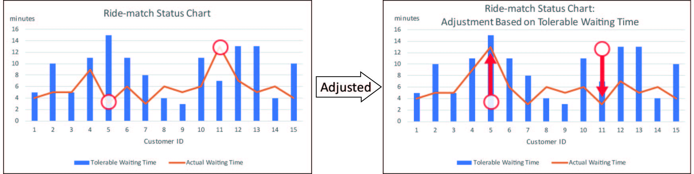
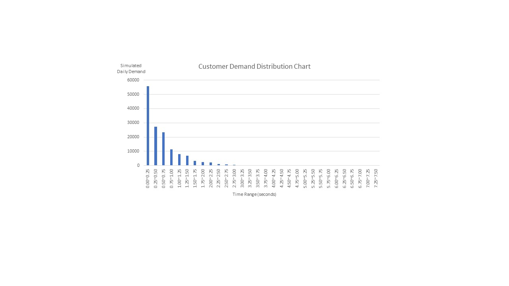
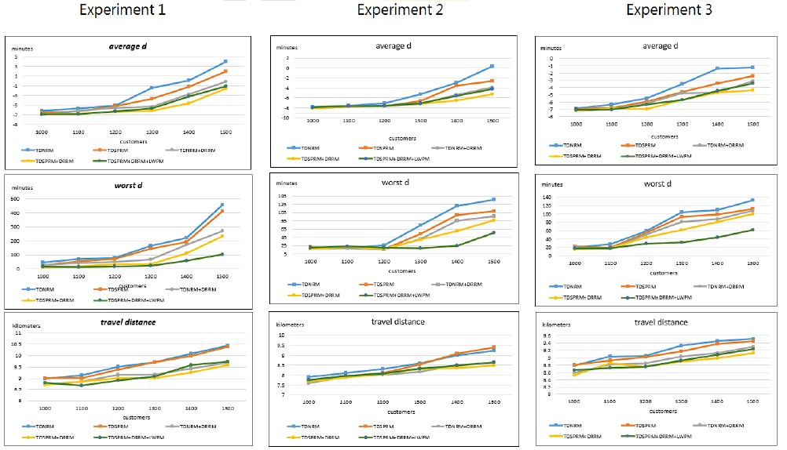

# Unmanned Taxis Service System Architecture Diagram

- In the context of unmanned taxi services, a ride-matching system that considers customers' tolerable waiting times has been proposed to minimize the inconvenience caused by late arrivals. This system incorporates multiple algorithmic strategies.

## Unmanned Taxis Ride-Matching System Bipartite Graph.

- The matching principle is one-to-one, with new passengers continually paired with taxis that have completed their previous service.

## Unmanned Taxis Ride-matching System

- Achieving the goal by utilizing customers' tolerable waiting times
    - Minimize the difference between the average actual waiting time and the tolerable waiting time
    - Minimize the maximum difference between the actual waiting time and the tolerable waiting time

## Experimental Environment

Node Class
- nodeID
- nodeX
- nodeY

Link Class
- linkID
- startNode
- endNode
- avgSpeed
- distance

Customer Class
- customerID
- isReservation
- tolerableWaitingTime
- currentNodeID
- currentLinkID
- pickUpNodeID
- dropOffNodeID
- currentOrder
- currentMatch

Taxi Class
- isMoving
- taxiSpeed
- currentNodeID
- currentLinkID
- nextNodeID
- currentMatch

ChargingStation Class
- chargerID
- locateNodeID

Match Class
- matchID
- customer
- taxi
- order

Order Class
- orderID
- orderCreator
- requestNodeID
- pickUpNodeID
- dropOffNodeID
- currentMatch
- matchedTaxi
- currentEvent

Event Class
- eventID
- eventCategory
- eventTimePoint
- relateOrder

## Data structure design

- This study uses exponential distribution to generate customer demand data for different time periods, simulating peak and off-peak demand scenarios for unmanned taxis in experimental settings.

## Simulation System

- Each time advancement action is considered a type of action.
- The arrival time of the first customer is calculated using an exponential distribution, creating the first event.
- Store all events in an ArrayList.
- Find the event that is closest to the current time from the list.
- Execute the customer's ride-hailing event, perform taxi matching, and upon successful matching, calculate the taxi arrival event and customer arrival event, as well as the next customer's ride-hailing event.
- Update the taxi arrival event or customer arrival event to confirm if both have arrived, then calculate the customer boarding event time.
- Once the customer boards, the taxi departs, and the arrival time at the destination is calculated, along with the drop-off event time.
- After the drop-off, the service is completed. Determine if the taxi needs charging or if it requires rematching; otherwise, the taxi returns to the available service pool.

| Experiment Name                                         | Fixed Variables                                                | Adjustable Variables                                        |
|---------------------------------------------------------|----------------------------------------------------------------|-------------------------------------------------------------|
| **Experiment 1** - Variation in Call Volume             | 1. Number of Taxis: 20 cars                                    | Call Volume: 1000, 1100, 1200, 1300, 1400, 1500            |
|                                                         | 2. Number of Reservations: 50 entries                          |                                                             |
|                                                         | 3. Number of Charging Stations: 30 stations                    |                                                             |
|                                                         | 4. Service Range: 10x10                                       |                                                             |
| **Experiment 2** - Variation in Call Volume and Peak Time | 1. Number of Taxis: 60 cars                                    | Call Volume: 1000, 1100, 1200, 1300, 1400, 1500            |
|                                                         | 2. Number of Reservations: 50 entries                          |                                                             |
|                                                         | 3. Number of Charging Stations: 30 stations                    |                                                             |
|                                                         | 4. Service Range: 10x10                                       |                                                             |
| **Experiment 3** - Variation in Call Volume, Peak Time, and Hotspot Calls | 1. Number of Taxis: 60 cars                                    | Call Volume: 1000, 1100, 1200, 1300, 1400, 1500            |
|                                                         | 2. Number of Reservations: 50 entries                          |                                                             |
|                                                         | 3. Number of Charging Stations: 30 stations                    |                                                             |
|                                                         | 4. Service Range: 10x10                                       |                                                             |
| **Experiment 4** - Variation in Reservation Volume, Peak Time, and Hotspot Calls | 1. Number of Taxis: 60 cars                                    | Estimated Total Reservation Volume: 120, 240, 360, 480, 600, 720 |
|                                                         | 2. Total Call Volume: 1500 entries                             |                                                             |
|                                                         | 3. Number of Charging Stations: 30 stations                    |                                                             |
|                                                         | 4. Service Range: 10x10                                       |                                                             |

## Experimental results
